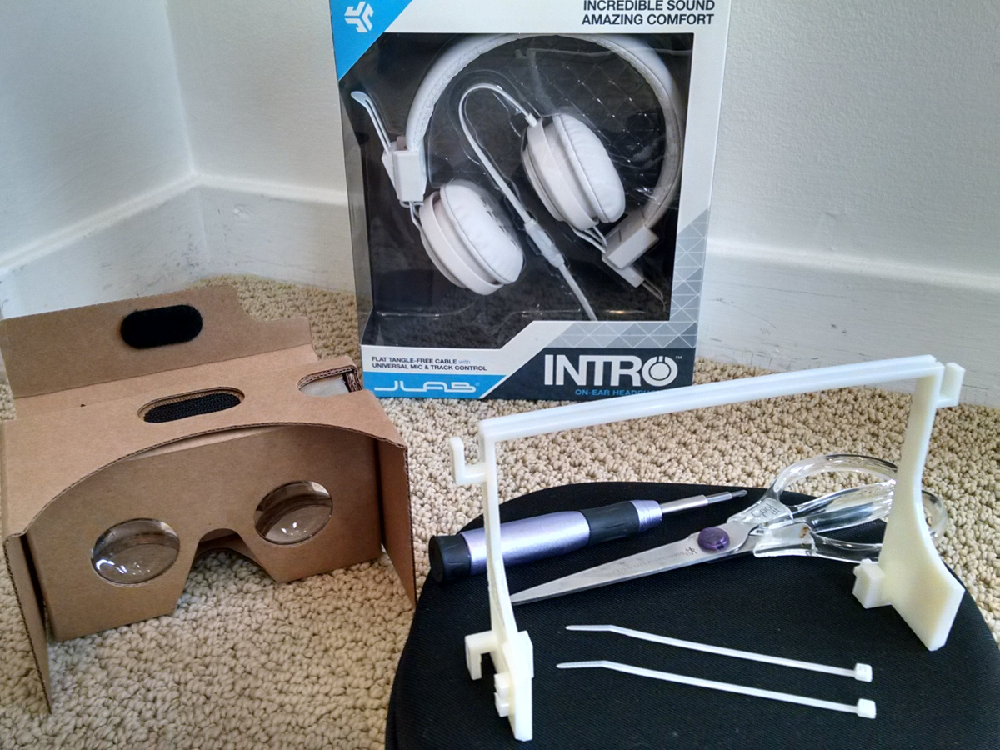

# Assembly instructions

Following are instructions for sourcing components and assembling a _Cardboard headphones_ VR viewer.  See the [home page](../../../) for more info about this project.

[ assembly photos](https://goo.gl/photos/LNsYvQ1QFXjgn7276 "Go to assembly photo gallery")

## What you'll need

* **Cardboard VR viewer** adhering to Google's "New Cardboard" open source design.  See the first row of viewers listed at [Get Cardboard](https://www.google.com/get/cardboard/get-cardboard/) (i.e. Knox V2, I AM CARDBOARD V2, and Unofficial Cardboard 2.0).
* **headphones** - JLab Audio "INTRO" headphones.  Available from [JLab directly](http://www.jlabaudio.com/products/intro-on-ear-headphone?variant=940963049), Amazon, Newegg, etc.
* **_Cardboard headphones_ frame** - use your favorite 3D printing service to make a copy of the [frame part](cardboard_headphones_frame.stl) in ABS plastic material
* **small phillips head screwdriver (#0)**
* **scissors**
* **small cable ties or tape**

## Steps

Be sure to refer to the [assembly photo gallery](https://goo.gl/photos/LNsYvQ1QFXjgn7276).  Photo descriptions are available in the gallery's "info" panel.

1. **Prepare headphones**
  1. **remove headband assembly**
    1. on each ear of the headphones, remove 2 screws which secure the headband and detach the headband (except for the connecting cord).  Save the screws since they'll be reused later.
    1. cut across full length of the headband with scissors to free the connecting cord
  1. **re-route connecting cord** - to have sufficient slack in the connecting cord it's necessary to remove the cord from the hinge assembly of each ear
    1. remove two screws which secure the hinge assembly
    1. with the hinge open and the speaker facing down, open the hinge assembly
    1. remove the glued connecting cord with gentle force and reassemble the hinge.  Be sure the clear plastic friction gliders on the headphone arms are reseated correctly.
1. **Attach headphones to frame**
  1. **mate left / right headphone assemblies to frame**
    1. for the **right side** (having the cord which connects to phone-- see photos), line up the headphone assembly's mount with the corresponding holes of the _Cardboard headphones_ frame.  Make sure the mount sits flush on the frame.
    1. fasten headphone assembly to frame using screws remaining from removal of the headband.  Don't over-tighten.
    1. repeat for left side
  1. **route the headphone right/left connecting cord**
    1. run the cord inside the channel on the top of the _Cardboard headphones_ frame and equalize the cord slack
    1. fasten the cord to sides of the frame using cable ties or tape
  1. **eliminate earpiece toe-in** - bend the metal arms slightly so that earpieces are parallel to each other.  This improves ease of on/off and headphone fit.
1. **Attach _Cardboard headphones_ to viewer**
  1. position the frame and the edge of the viewer, ensuring the top corners of the viewer fit within the frame and the sides of the viewer slip into the lower frame channels
  1. using your index fingers and thumbs, slide the frame equally on both sides until it stops.  The lower part of the frame should be flush with the viewer's lens panel, and the top part of the frame should be just at the edge of the viewer's button
1. **Route audio cord**
  1. decide whether you want the headphone jack to be on the left or right side (based on your phone having top or bottom audio jack, respectively)
  1. with headphone arms fully extended, route the audio cord using brackets on the _Cardboard headphones_ frame as needed.  If you need the jack on the left side, run the cord along the top of the frame (pictured).
